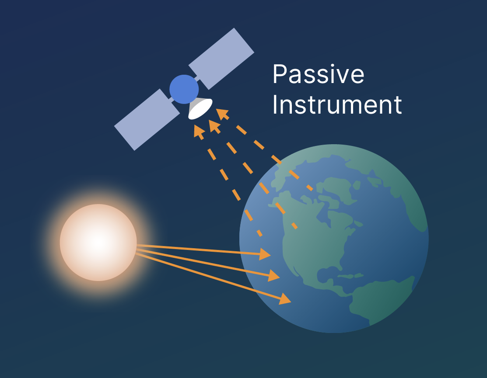
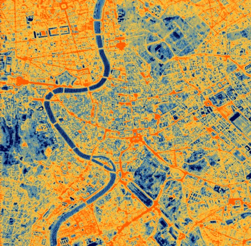
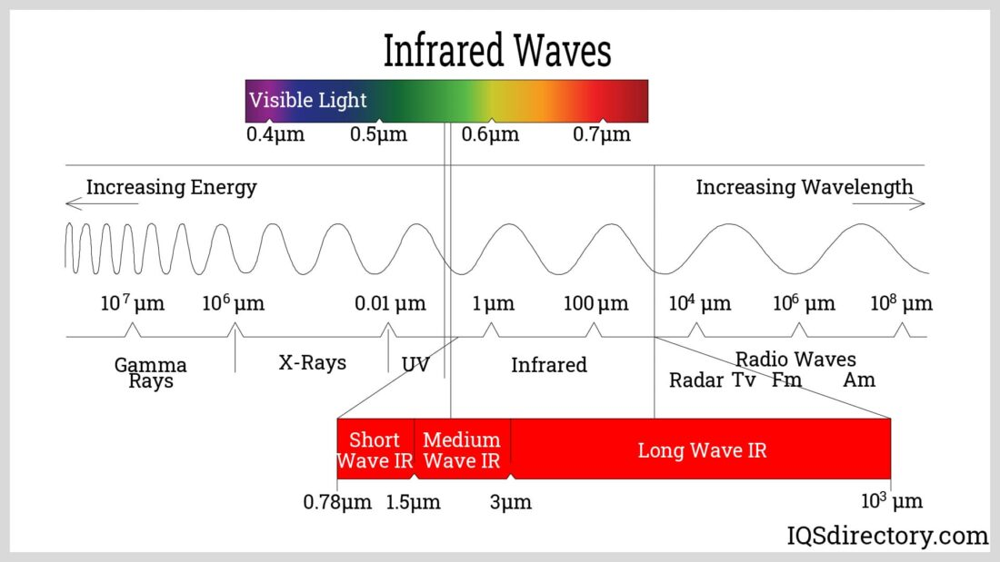
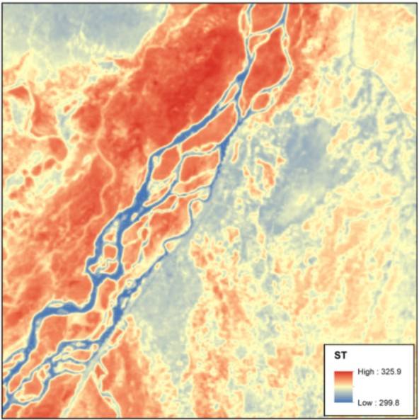
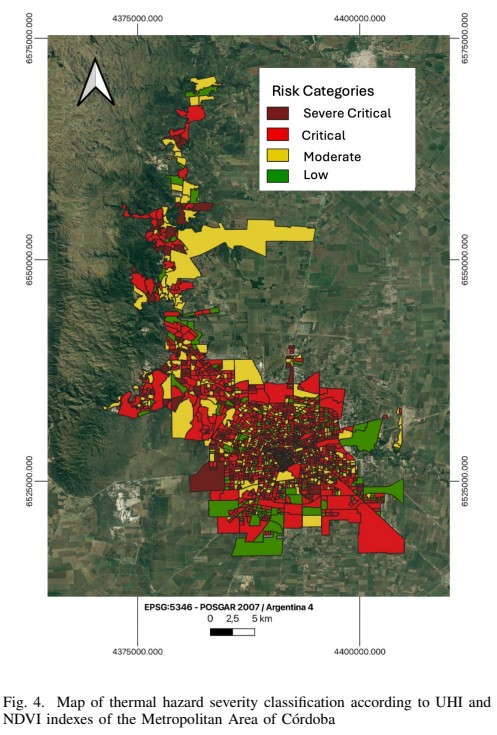
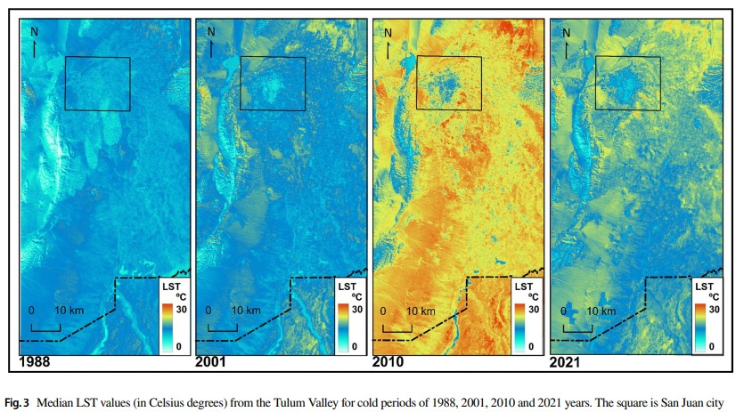

class:inverse, middle

background-image: "https://drive.google.com/drive/folders/11hjW6NbIPmSPC8Vp2xNlTdk_Osule0A2"
background-position: 95% 95%
background-size: 30%

# Passive Remote Sensing in Earth Observation

## The Case of Thermal Sensing

<br>
<br>
<br>
<br>
<br>
<br>
<br>
<br>
<br>

### By Santiago Soubie 

```{r setup, include=FALSE}
# First, We set some basic stuff for our presentation.
options(htmltools.dir.version = FALSE)
knitr::opts_chunk$set(
  fig.width= 9, fig.height = 3.5, fig.retina = 3,
  out.width = "100%",
  cache = FALSE,
  echo = FALSE,
  message = FALSE, 
  warning = FALSE,
  fig.show = TRUE,
  hiline = TRUE
)
```

```{r, echo=FALSE}
# We are going to add some extras.
# We upload package xaringanExtra.
library(xaringanExtra)

# We add a progress bar.
use_progress_bar(color = "#252C4F")

# We add a pencil.
use_scribble()

# We add the slide searcher.
use_tile_view()

```

```{r, include=FALSE, warning=FALSE, eval=TRUE}

# Finally, we are going to use the template provided by the Directorate of Markets and Statistics of the Undersecretary of Tourism of Argentina. 

# If you want to lean more, you can visit https://github.com/dnme-minturdep/comunicacion

library(xaringanthemer)
library(comunicacion)
style_mono_light(outfile = "dnmye_theme.css", # CSS FILE
                 # FONTS
                 header_font_google = google_font('Encode Sans'),
                 text_font_google   = google_font('Roboto'),
                 code_font_google   = google_font('IBM Plex Mono'),
                 # COLORES 
                 base_color = "#252C4F",
                 code_inline_color = dnmye_colores("rosa"), 
                 inverse_link_color = "#3B4449",
                 background_color = "#FFFFFF",
                 title_slide_background_position = "95% 5%", 
                 title_slide_background_size = "200px",
                 footnote_color = "#3B4449",
                 link_color = "3B4449",
                 text_slide_number_font_size = "16px")
```

---

# Passive Remote Sensors

.pull-left[

- Use **naturally reflected or emitted** electromagnetic radiation (EMR) from the Sun or objects on the Earth's surface 

- Cover the electromagnetic spectrum in the wavelength range from gamma rays to microwaves

- Oldies but goldies: Photographic cameras the oldest and most common sensor

**LIMITATIONS:**

- Measurements depend on:

  - **Solar illumination** (Some sensor only work during daylight)

  - **Atmospheric conditions**


]

.pull-right[

```{r fig.align='center'}

```

Source: [NASA](https://www.earthdata.nasa.gov/learn/earth-observation-data-basics/remote-sensing/passive-instruments)

]

---

# Thermal Remote Sensors

.pull-left[

- A subtype of **passive sensor**

- **Measure emitted energy** (thermal infrared radiation), not reflected sunlight.
  
- The future of work? Can operate both day and night.

- Fields of application:

  - Climate & meteorology
  
  - Agriculture & hydrology
  
  - Urban planning & public health
  
  - Risk management

]

.pull-right[

```{r fig.align='center', out.width='80%'}

```

Source: SatVu

]
---

# Infrared Spectrum

```{r fig.align='center', , out.width='80%'}

```

---

# Thermal Remote Sensors

Emitted (and detected) **radiation depends** on:

.pull-left[

- **Object properties**
  
  - Roughness
    
  - Material
    
  - Texture
    
  - Moisture

- **Atmospheric Interference**
  
  - The presence or absence of certain molecules on air
    
  - Cloud cover
    
]

.pull-right[

- **Surface temperature**
    
- **[Emissivity](https://www.npl.co.uk/resources/q-a/why-is-emissivity-important)**
  
  - Efficiency with which a surface emits thermal radiation relative to a perfect blackbody
    
  - Not Reflectance (but related - Usually an inverse relationship)
  
- **Geometric and Viewing Effects**
  
  - Slope
   
  - Sensor's angle
   
]


---

# [Landsat-8 Thermal Infrared Sensor (TIRS)](https://science.nasa.gov/mission/landsat/tirs/)

.pull-left[

<br>

- Onboard the **NASA/USGS [Landsat 8](https://science.nasa.gov/mission/landsat-8/)** mission

  - Upgraded version TIRS-2 on board Landsat-9

- Measures **Land Surface Temperature (LST)**

  - Use two thermal infrared bands (10 & 11) using principles of quantum physics

- **Spatial resolution**: ~100 m (resampled to 30 m)

- **Spectral resolution**: 10.6-12.5 µm

- Global Earth monitoring capability

]

.pull-right[

```{r fig.align='center', out.width='80%'}

```

Landsat 8 Collection 2 level-2 surface temperature image

]

---

class: inverse center middle

# APPLICATIONS

---

### Analysis of the Impact of Vegetation Cover on The Urban Heat Island Phenomenon in the Metropolitan Area of Córdoba, Argentina

.pull-left[

#### [Dedeu et al, 2025](https://www.researchgate.net/publication/397982449_Analysis_of_the_Impact_of_Vegetation_Cover_on_The_Urban_Heat_Island_Phenomenon_in_the_Metropolitan_Area_of_Cordoba_Argentina)

This study examines **heat islands** in the Greater Córdoba, Argentina, focusing on the role of vegetation in moderating urban temperatures. **Satellite imagery and Google Earth Engine** were used to calculate the **Normalized Difference Vegetation Index (NDVI)** and **Land Surface Temperature (LST)** across 2020. The results show a **strong inverse relationship between vegetation density and temperature**, with the highly urbanized city centre registering temperatures more than 4 °C higher than surrounding greener peripheries. Based on these findings, the researchers produced a **thermal severity map** that classified urban areas into four levels of heat risk, enabling policymakers to identify locations that require priority intervention.

]

.pull-right[

```{r fig.align='right', out.width='60%'}

```

]

---


### Land Surface Temperature in an Arid City: Assessing Spatio-temporal Changes

.pull-left[

#### [Campos et al, 2023](https://link.springer.com/article/10.1007/s41976-023-00085-w)

This study analyzes **Land Surface Temperature (LST)** trends in Argentina’s arid Tulum Valley from 1988 to 2021 using **satellite remote sensing data**. The researchers examined the **Urban Cool Island (UCI) effect**, where the city can be cooler than the surrounding desert-like rural areas. Results show that **vegetation generally reduces surface temperatures**, although its **cooling effect changes seasonally due to the leaf cycles** of urban trees. In contrast, **the expansion of built-up areas and certain bare soil characteristics contribute to higher temperatures**. The study highlights the importance of urban vegetation and **land-use planning** as strategies to mitigate heat in arid environments and shows how thermal sensor can be used to **measure urban expansion**.

]

.pull-left[

<br>
<br>

```{r fig.align='center', fig.align='right'}

```

]

---

# Final thoughts

<br>

- Allows temperature monitoring independently from sunlight

- For sure, a really valuable source of information with applications in many fields

  - But, particularly key for understanding environmental processes and climate change

  - In a momentum? Global warming, heat waves, urban planning, and disaster management

- Houston, we have a problem! Many factors to bare in mind while working with them!

- Conclusion: A big opportunity!

  - Growing importance

  - Increasing availability of high-resolution data
  
  - Integration with machine learning and climate models.


